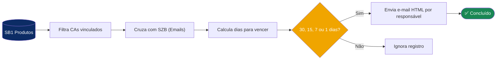
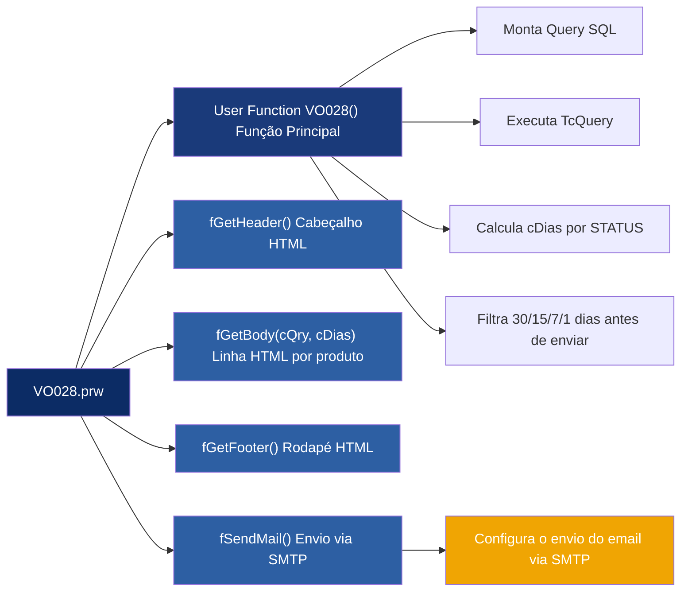
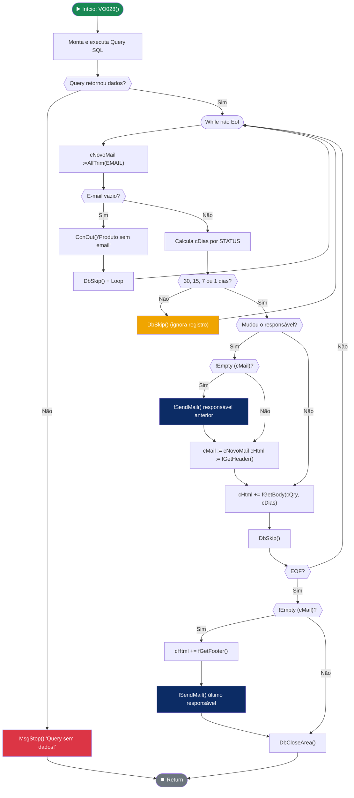
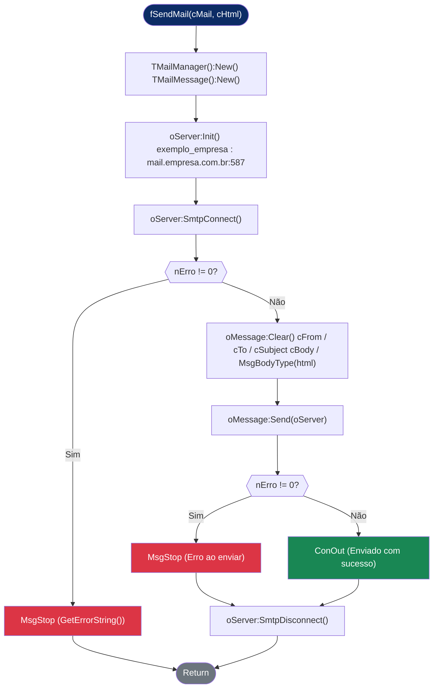
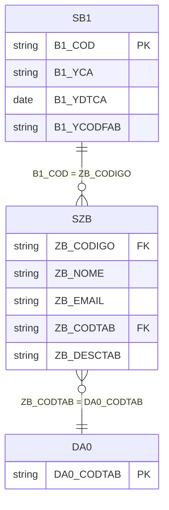
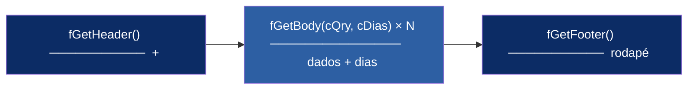
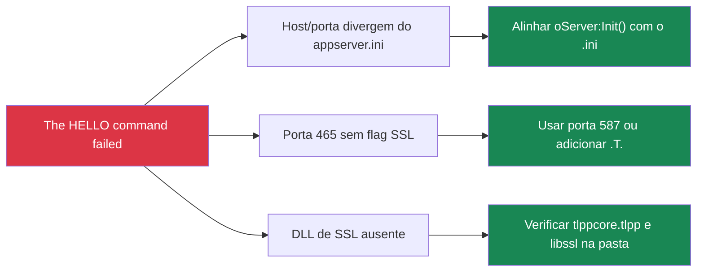

#  Workflow de Certificados de Aprovação (CA)

> **Protheus TOTVS** · AdvPL · Versão 1.1  
> Autor: ERP-Tools · Atualizado: 2026

---

## Índice

- [Visão Geral](#visão-geral)
- [Pré-requisitos](#pré-requisitos)
- [Configuração SMTP](#configuração-smtp)
- [Estrutura do Código](#estrutura-do-código)
- [Fluxo Principal](#fluxo-principal)
- [Fluxo de Envio de E-mail](#fluxo-de-envio-de-e-mail)
- [Funções](#funções)
- [Query SQL](#query-sql)
- [Montagem do HTML](#montagem-do-html)
- [Erros Comuns](#erros-comuns)

---

## Visão Geral

A função `VO028` é um **workflow automático** que varre o cadastro de produtos (`SB1`) em busca de itens com **Certificado de Aprovação (CA)** vinculado, verifica o status de vencimento de cada CA e **envia um e-mail HTML** para o responsável cadastrado na tabela `SZB` (Cadastro de Emails).

Cada responsável recebe **um único e-mail consolidado** com todos os seus produtos listados em uma tabela HTML formatada, incluindo a coluna de **dias restantes ou vencidos**.

O envio é disparado apenas quando faltam **30, 15, 7 ou 1 dias** para o vencimento do CA.



---

## Pré-requisitos

| Requisito | Detalhe |
|-----------|---------|
| **Protheus** | P12 ou superior |
| **Módulo** | Estoque/Custos (SB1 disponível) |
| **Tabela SZB** | Cadastro de e-mails preenchido (`ZB_EMAIL`) |
| **Tabela DA0** | Tabela de grupos vinculada ao `ZB_CODTAB` da SZB |
| **CA do Produto** | Campos `B1_YCA` e `B1_YDTCA` preenchidos em SB1 |
| **SMTP** | Configurado no `appserver.ini` |

---

## Configuração SMTP

No arquivo `appserver.ini` do servidor Protheus, configure a seção `[MAIL]`:

```ini
[MAIL]
User=seu_email@exemplo
Pass=sua_senha
Auth=1
TLS=1
PROTOCOL=POP3
TLSVERSION=3
SSLVERSION=3
TRYPROTOCOLS=0
AUTHLOGIN=1
AUTHPLAIN=1
AUTHNTLM=1

[SSLConfigure]
CertificateServer=totvs_certificate.crt
KeyServer=totvs_certificate_key.pem
```

> [!IMPORTANT]
>‼️O host e a porta usados em `oServer:Init()` no código devem ser idênticos ao `appserver.ini`. Divergências causam o erro *The HELLO command failed*.

---

## Estrutura do Código



---

## Fluxo Principal



---

## Fluxo de Envio de E-mail



---

## Funções

### `User Function VO028()`

Função principal. Executa a query, calcula os dias de vencimento, filtra pelos marcos de 30/15/7/1 dias e dispara os envios agrupados por e-mail.

```advpl
User Function VO028()

Local cSQL      := ""
Local cQry      := GetNextAlias()
Local cMail     := ""   // E-mail do responsável anterior
Local cHtml     := ""   // HTML acumulado
Local cNovoMail := ""   // E-mail do registro atual
Local cDias     := ""   // Texto descritivo de dias
```

---

### `Static Function fGetHeader()`

Retorna a abertura do HTML com estilos CSS e o cabeçalho da tabela, incluindo a coluna **Dias**.

```advpl
Static Function fGetHeader()
Local cRet := ""
// ...estilos CSS...
cRet += '<th class="styleCabecalho"> ID              </th>'
cRet += '<th class="styleCabecalho"> Nome            </th>'
cRet += '<th class="styleCabecalho"> Email           </th>'
cRet += '<th class="styleCabecalho"> Codigo Tabela   </th>'
cRet += '<th class="styleCabecalho"> Descricao       </th>'
cRet += '<th class="styleCabecalho"> Data CA         </th>'
cRet += '<th class="styleCabecalho"> Status          </th>'
cRet += '<th class="styleCabecalho"> Dias            </th>'
Return cRet
```

---

### `Static Function fGetBody(cQry, cDias)`

Recebe o alias da query e o texto de dias calculado na função principal, retornando uma linha HTML com todos os dados do produto.

```advpl
Static Function fGetBody(cQry, cDias)
Local cRet := ""
cRet += '<tr>'
cRet += '<th class="styleLinha">' + AllTrim((cQry)->ID)            + '</th>'
cRet += '<th class="styleLinha">' + AllTrim((cQry)->NOME)          + '</th>'
cRet += '<th class="styleLinha">' + AllTrim((cQry)->EMAIL)         + '</th>'
cRet += '<th class="styleLinha">' + AllTrim((cQry)->CODIGO_TABELA) + '</th>'
cRet += '<th class="styleLinha">' + AllTrim((cQry)->DESCRICAO)     + '</th>'
cRet += '<th class="styleLinha">' + AllTrim((cQry)->DATA_CA)       + '</th>'
cRet += '<th class="styleLinha">' + AllTrim((cQry)->STATUS)        + '</th>'
cRet += '<th class="styleLinha">' + AllTrim(cDias)                 + '</th>'
cRet += '</tr>'
Return cRet
```

---

### `Static Function fGetFooter()`

Fecha a tabela e o HTML com uma barra de rodapé.

```advpl
Static Function fGetFooter()
Local cRet := ""
cRet += '<td class="styleRodape" colspan="13">'
cRet += 'E-mail enviado automaticamente pelo sistema Protheus - VO028'
cRet += '</td>'
// ...fecha table, body, html...
Return cRet
```

---

### `Static Function fSendMail(cMail, cHtml)`

Realiza a conexão SMTP e envia o e-mail HTML para o destinatário.

```advpl
Static Function fSendMail(cMail, cHtml)
   Local oServer  := TMailManager():New()
   Local oMessage := TMailMessage():New()
   Local nErro    := 0

   oServer:Init( "", "mail.empresa.com.br", "seu_email@exemplo", "sua_senha", 0, 587 )

   If ( nErro := oServer:SmtpConnect() ) != 0
       MsgStop("Erro SMTP: " + oServer:GetErrorString(nErro))
       Return
   EndIf

   oMessage:Clear()
   oMessage:cFrom    := "seu_email@exemplo"
   oMessage:cTo      := cMail
   oMessage:cSubject := "Recebimento de Material"
   oMessage:cBody    := cHtml
   oMessage:MsgBodyType("text/html")

   nErro := oMessage:Send(oServer)
   If nErro != 0
       MsgStop("Erro ao enviar para: " + cMail + " - " + oServer:GetErrorString(nErro))
   Else
       ConOut("Enviado com sucesso para: " + cMail)
   EndIf

   oServer:SmtpDisconnect()
Return
```

---

## Query SQL

A query usa `SB1` como tabela principal, cruzando com `SZB` (cadastro de emails) e `DA0` (grupos), calculando status e dias de vencimento do CA:

```sql
SELECT
    SZB.ZB_CODIGO  AS ID,
    SZB.ZB_NOME    AS NOME,
    SZB.ZB_EMAIL   AS EMAIL,
    SZB.ZB_CODTAB  AS CODIGO_TABELA,
    SZB.ZB_DESCTAB AS DESCRICAO,
    SB1.B1_YCA     AS CA,
    CONVERT(VARCHAR(10), CAST(SB1.B1_YDTCA AS DATETIME), 103) AS DATA_CA,
    SB1.B1_YCODFAB AS COD_FABRICANTE,
    CASE
        WHEN DATEDIFF(day, SB1.B1_YDTCA, GETDATE()) > 0 THEN 'Vencido'
        WHEN DATEDIFF(day, SB1.B1_YDTCA, GETDATE()) < 0 THEN 'A Vencer'
        ELSE 'Vence Hoje'
    END AS STATUS,
    ABS(DATEDIFF(day, SB1.B1_YDTCA, GETDATE())) AS DIAS
FROM SB1990 SB1
INNER JOIN SZB990 SZB
    ON  SZB.ZB_CODIGO = SB1.B1_COD
    AND SZB.D_E_L_E_T_ = ''
    AND SZB.ZB_EMAIL  <> ''
INNER JOIN DA0990 DA0
    ON  DA0.DA0_CODTAB = SZB.ZB_CODTAB
    AND DA0.D_E_L_E_T_ = ''
WHERE SB1.D_E_L_E_T_ = ''
  AND SB1.B1_YCA     <> ''
  AND SB1.B1_YCA      > '0'
```

### Relacionamento entre tabelas



### Lógica de Status e Dias

| Condição `DATEDIFF` | STATUS | Coluna DIAS |
|--------------------|--------|-------------|
| `> 0` (data CA < hoje) | 🔴 **Vencido** | `Vencido há X dias ` |
| `< 0` (data CA > hoje) | 🟡 **Preste a Vencer** | `Vence em X dias` |
| `= 0` (data CA = hoje) | 🟠 **Vence Hoje** | `Vence hoje` |

### Regra de disparo do e-mail

O e-mail **só é enviado** quando o STATUS for `A Vencer` e a quantidade de dias for exatamente:

| Dias restantes | Envia? |
|---------------|--------|
| 30 dias | ✅ Sim |
| 15 dias | ✅ Sim |
| 7 dias  | ✅ Sim |
| 1 dias  | ✅ Sim |
| Qualquer outro valor | ❌ Não |

```advpl
If AllTrim((cQry)->STATUS) == "A Vencer" .And. ;
((cQry)->DIAS = 30 .OR. (cQry)->DIAS = 15 .OR. (cQry)->DIAS = 7 .OR. (cQry)->DIAS = 1)
    // monta e envia o e-mail
EndIf
```

---

## Montagem do HTML

O e-mail é construído em três partes que formam uma tabela HTML:



### Estilos CSS do e-mail

| Classe | Aplicação | Cor de fundo |
|--------|-----------|-------------|
| `.styleCabecalho` | Cabeçalho da tabela | `#0c2c65` (azul escuro) |
| `.styleLinha` | Linhas de dados | `#f6f6f6` (cinza claro) |
| `.styleRodape` | Rodapé | `#0c2c65` (azul escuro) |
| `#status` | Coluna Dias (destaque) | `#9c1717` (vermelho) |

---

## Erros Comuns

### `The HELLO command failed`



### `Fail to get 'TlppData'`

Adicionar no `appserver.ini`:

```ini
[TLS]
TlsEnable=1
TlppData=C:\TOTVS\Protheus\bin\AppServer\tlpp\tlppcore.tlpp
```

### Último responsável não recebe e-mail

Garantido pelo bloco após o loop — **não remover**:

```advpl
// Este bloco envia o último responsável que não é disparado dentro do While
If !Empty(cMail)
    cHtml += fGetFooter()
    fSendMail(cMail, cHtml)
EndIf
```

### Campo DIAS vazio no e-mail

Verificar se o `cDias` está sendo passado corretamente na chamada da função:

```advpl
// ❌ Errado — cDias não chega na função
cHtml += fGetBody(cQry)

// ✅ Correto
cHtml += fGetBody(cQry, cDias)
```

---

## Observações Finais

- Os campos `B1_YCA` e `B1_YDTCA` são **campos customizados** (prefixo `Y`), específicos do dicionário desta empresa.
- A tabela `SZB` é um cadastro customizado de e-mails — verifique os campos no SX3 do seu ambiente.
- O filtro de 30/15/7/1 dias pode ser ajustado conforme a necessidade do negócio.
- O `ABS()` no `DATEDIFF` garante que a coluna `DIAS` sempre exiba valor positivo, independente do status.

---

*Documentação gerada · VO028 v1.1 · ERP-Tools · 2026*
